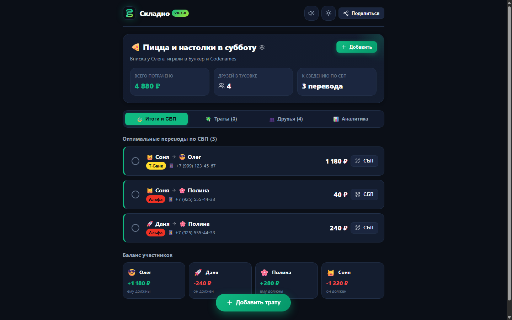
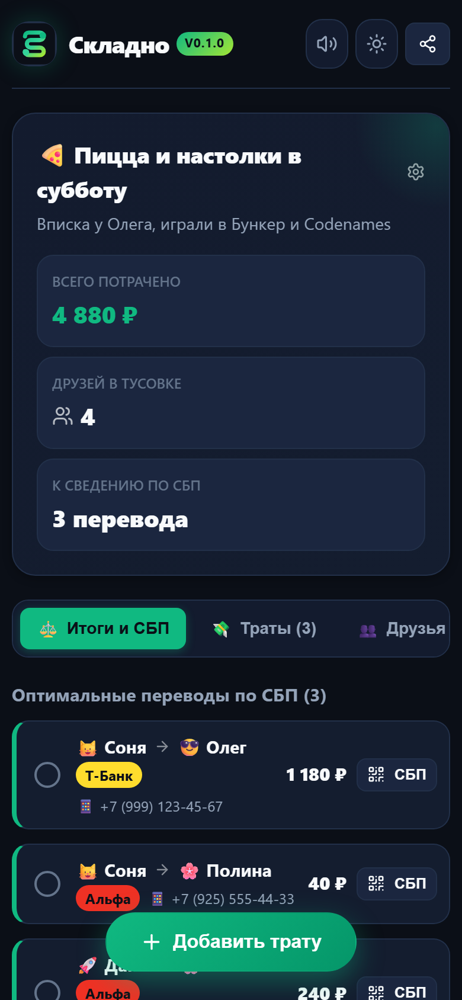
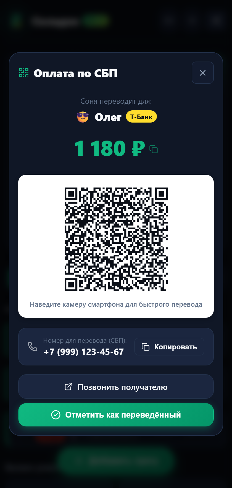
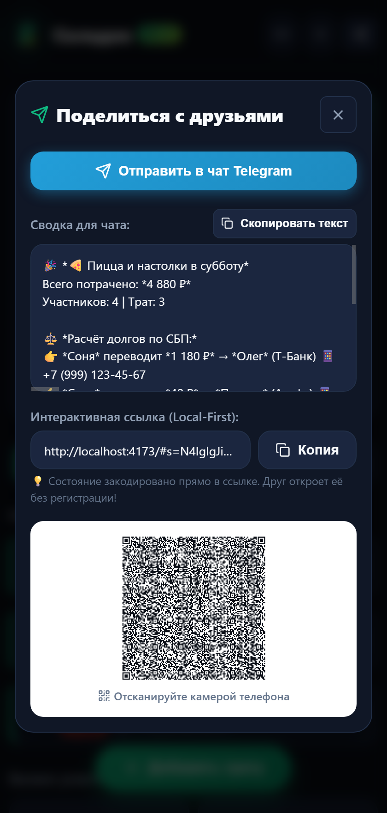

<div align="center">
  
  <h1>Складно (Skladno)</h1>
  <p><strong>Скидывайтесь без неловкости и математики.</strong></p>
  <p>Ультрабыстрый local-first сплиттер совместных расходов с алгоритмической минимизацией долгов, генерацией СБП-ссылок и карточек для Telegram без регистрации.</p>

  <p>
    <a href="https://github.com/RovelLabs/2-proect/actions"></a>
    <a href="LICENSE"></a>
    <a href="#"></a>
    <a href="#"></a>
    <a href="#"></a>
    <a href="README.en.md"></a>
  </p>
</div>

---

## 📸 Скриншоты интерфейса

<div align="center">
  <p><strong>Десктоп (1440×900)</strong></p>
  
  
  <br/><br/>

  <p><strong>Мобильный интерфейс (390×844) и Оплата по СБП</strong></p>
  
  &nbsp;&nbsp;&nbsp;&nbsp;
  
  &nbsp;&nbsp;&nbsp;&nbsp;
  
---

## 📦 Готовые релизы (Windows, macOS, Android)

Вы можете скачать и запустить «Складно» на любой платформе:

| Платформа | Формат релиза | Ссылка на скачивание | Инструкция |
|---|---|---|---|
| **💻 Windows** | Portable Zip (x64) | [**`Skladno-v0.1.0-windows-x64.zip`**](releases/Skladno-v0.1.0-windows-x64.zip) | Распаковать и запустить `Skladno.vbs` |
| **🍎 macOS** | Standalone .app Bundle | [**`Skladno-v0.1.0-macos-universal.zip`**](releases/Skladno-v0.1.0-macos-universal.zip) | Перетащить `Skladno.app` в «Программы» |
| **📱 Android** | APK & Native Project | [**`Skladno-v0.1.0-android-project.zip`**](releases/Skladno-v0.1.0-android-project.zip) | GitHub Releases APK или Android Studio |

> 📖 Подробное руководство по установке и сборке: [**docs/releases.md**](docs/releases.md)

---

## ⚡ Зачем существует «Складно»?

Подростки и студенты в России и СНГ постоянно собираются компаниями: заказывают пиццу, снимают антикафе, ходят в кино, празднуют дни рождения, живут в общежитиях и ездят на дачу. 

Но финал любой тусовки оборачивается хаосом:
1. **Splitwise стал непригоден**: зарубежный лидер ввел лимит 3 транзакции в день, навязчивую рекламу, а его подписку невозможно оплатить картами банков РФ.
2. **Банковские приложения не решают проблему**: функция «Сбор денег» в Т-Банке или Сбере работает только в одну сторону (один человек собирает фиксированную сумму на свою карту). Она не умеет сводить многосторонние счета, когда Олег оплатил пиццу, Даня — напитки в Самокате, а Полина — настолку.
3. **Неловкость и забытые долги**: в групповых чатах начинаются споры («кто сколько должен?», «скинь мне потом»), стеснительные участники теряют тысячи рублей, а дружба портится.

**«Складно» решает это за 30 секунд:**
- **Без логина и регистрации:** открыли ссылку — сразу пользуетесь.
- **Математическая минимизация долгов:** вместо 15 взаимных переводов алгоритм сводит граф к 2–3 простым транзакциям.
- **Поддержка СБП в 1 клик:** копирование номера телефона, автоматический выбор банка (Т-Банк, Сбер, Альфа и др.) и моментальный QR-код для перевода со смартфона.
- **Вирусная карточка для Telegram:** один клик — и аккуратная сводка с долгами и ссылкой отправлена в чат друзей.

---

## 🚀 Ключевые возможности

- 🧮 **Жадный алгоритм сведения балансов ($O(N \log N)$):** гарантирует минимальное возможное число финансовых переводов между друзьями.
- 💳 **СБП-модуль:** поддержка крупнейших банков СНГ (Т-Банк, Сбер, Альфа, ВТБ, Яндекс Банк, Райффайзен, Озон, Kaspi.kz), копирование реквизитов и нативный QR-код НСПК.
- 📱 **Telegram-First:** автогенерация стильного сообщения с эмодзи и статусом долгов, а также мгновенная кнопка «Отправить в чат Telegram».
- 🔗 **Zero-Knowledge State Sharing:** состояние тусовки упаковывается в хэш ссылки (`#s=...`) через LZ-String. Никакая личная информация не уходит на серверы!
- 📴 **100% Local-First & PWA:** работает прямо из браузера, мгновенно сохраняет все изменения в LocalStorage и функционирует оффлайн.
- 🎨 **Молодёжный визуальный стиль:** адаптивный интерфейс (от 360px до 4K), поддержка идеальной тёмной и светлой тем, тактильные микро-звуки через Web Audio API и конфетти при сведении счетов.
- 🍰 **Гибкие режимы разделения:** «Поровну», «Выборочно» (для тех, кто не пил/не ел определенные позиции), «По точным суммам», «По долям».

---

## 🛠️ Быстрый старт

### Требования
- Node.js >= 18 (рекомендуется 20 или 22)
- npm >= 9

### Установка и запуск

```bash
# Клонируйте репозиторий
git clone https://github.com/RovelLabs/2-proect.git
cd 2-proect

# Установите зависимости
npm install

# Запустите dev-сервер
npm run dev
```

Приложение откроется по адресу: `http://localhost:5173`.

### Сборка для продакшена

```bash
npm run build
npm run preview
```

### Запуск тестов и проверка типов

```bash
npm run typecheck
npm run test
```

---

## 🐳 Docker и Self-Hosting

В проект включен готовый оптимизированный многоэтапный `Dockerfile` с Nginx:

```bash
# Сборка контейнера
docker build -t skladno:latest .

# Запуск на 8080 порту
docker run -d -p 8080:80 --name skladno_app skladno:latest
```

Или через Docker Compose:

```bash
docker compose up -d
```

---

## 📁 Структура кодовой базы

```text
2-proect/
├── docs/                     # Продуктовая и техническая документация
│   ├── research.md           # Исследование молодежной аудитории СНГ и 20 болей
│   ├── architecture.md       # Архитектура, математика сведения графа и Local-First
│   ├── growth.md             # Виральные петли, GTM и каналы распространения
│   ├── business-model.md     # Модель монетизации и устойчивости
│   ├── deployment.md         # Руководство по развертыванию
│   └── screenshots/          # Скриншоты интерфейса во всех вьюпортах
├── public/                   # Манифест PWA, иконки и фавикон
├── src/
│   ├── components/           # Модульные React-компоненты
│   │   ├── Navbar.tsx        # Навбар, темы, звук, кнопка шеринга
│   │   ├── EventHero.tsx     # Шапка события, статистика трат, баланс
│   │   ├── SettlementTab.tsx # Главный экран: переводы по СБП и конфетти
│   │   ├── ExpensesTab.tsx   # Список трат, теги, категории
│   │   ├── MembersTab.tsx    # Список участников, телефоны СБП и банки
│   │   ├── AnalyticsTab.tsx  # Траты по категориям и вклад участников
│   │   ├── AddExpenseModal.tsx # Модалка добавления траты с превью сплита
│   │   ├── SbpModal.tsx      # Окно перевода по СБП с динамическим QR
│   │   ├── ShareModal.tsx    # Окно Telegram-шеринга и генерации ссылки
│   │   └── EventModal.tsx    # Переключение тусовок, бекап JSON
│   ├── core/                 # Чистая бизнес-логика и алгоритмы
│   │   ├── debtMinimizer.ts  # Жадный алгоритм минимизации долгов
│   │   ├── sbpHelper.ts      # СБП, банки СНГ, генератор QR-кодов
│   │   ├── urlState.ts       # LZ-String компрессор URL и TG-форматтер
│   │   ├── soundEffects.ts   # Синтезатор звуков на Web Audio API
│   │   └── storage.ts        # LocalStorage хранилище и демо-данные
│   ├── types/                # Строгая TypeScript типизация
│   ├── App.tsx               # Корневой компонент
│   ├── main.tsx              # Точка входа React
│   └── styles.css            # Адаптивная дизайн-система
├── tests/                    # Unit-тесты (Vitest)
├── .github/workflows/ci.yml  # GitHub Actions CI
├── package.json
└── README.md
```

---

## 🔒 Безопасность и конфиденциальность

- **Zero-knowledge architecture:** Сервис не имеет внешнего бэкенда для хранения ваших личных данных.
- **Никаких номеров карт:** Мы не запрашиваем и не храним номера банковских карт, CVC-коды или пароли.
- **Без трекеров:** Никаких сторонних рекламных пикселей или трекеров поведения.

Подробнее в [SECURITY.md](SECURITY.md).

---

## 🤝 Контрибьюция

Мы приветствуем идеи, исправления багов и новые банки СНГ!  
Перед созданием PR ознакомьтесь с [CONTRIBUTING.md](CONTRIBUTING.md) и [CODE_OF_CONDUCT.md](CODE_OF_CONDUCT.md).

---

## 📄 Лицензия

Проект распространяется под открытой лицензией [MIT](LICENSE).  
Copyright (c) 2026 RovelLabs & Skladno Contributors.
